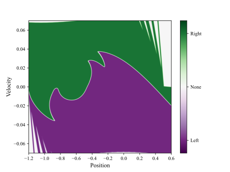

# Quantum-enhanced policy iteration on the example of a mountain car

Reference implementation for

> E. E. Nuzhin and D. Yudin, *Quantum-enhanced policy iteration on the example
> of a mountain car*, [arXiv:2308.08348](https://doi.org/10.48550/arXiv.2308.08348).

QEPI keeps the structure of classical policy iteration but moves the policy
evaluation step to a quantum annealer: the policy-conditioned Bellman equation
is written as a system of linear equations, the SLE is binarised into a QUBO,
and the QUBO is handed to an annealer. The policy improvement step stays
classical. The repository also contains the soft value iteration used in the
paper to obtain an interpretable policy.

Optimal policies over the phase space of the car, with and without smoothing:

| Soft value iteration                         | Value iteration                        |
|----------------------------------------------|----------------------------------------|
|  |  |

## Requirements

Python 3.10 or newer, and:

| Package | Used for |
|---|---|
| `numpy`, `torch`, `torchvision` | the algorithms; `torchvision` supplies the Gaussian blur |
| `gymnasium` | mountain-car dynamics |
| `qubovert` | the annealing emulator used in the paper |
| `dimod` | classical simulated annealing |
| `matplotlib`, `tqdm` | plots and progress bars |

Optional:

| Package | Used for |
|---|---|
| `dwave-system` | D-Wave hardware (`--backend dwave` or `hybrid`), needs an API token from a [D-Wave Leap](https://cloud.dwavesys.com/leap/) account |
The fine-grid value-iteration runs are impractical without a GPU.

## Install

```bash
git clone https://github.com/enuzhin/QEPI.git && cd QEPI
uv sync
```

Or without uv:

```bash
python -m venv .venv && source .venv/bin/activate
pip install -e .
```

For the hardware experiments:

```bash
uv sync --extra hardware
dwave config create
```

## Reproducing experiments

Five experiments, one script each. Numerical results are written to `data/`
and plots to `images/`. Each script's defaults are the configuration reported
in the paper, so no flags are needed to reproduce it.

| Script | Experiment |
|---|---|
| `experiments/vi_soft_vi.py` | Value iteration on a fine grid, with and without Gaussian smoothing of the Q function, giving the optimal policy and value function in each case. |
| `experiments/qepi_simulator.py` | The full QEPI loop on the coarse mesh, compared with classical policy iteration on the same discretisation. |
| `experiments/qepi_sweep.py` | How often QEPI reaches the classical optimum as a function of the number of anneals and the annealing duration. |
| `experiments/dwave_accuracy.py` | Residual of a single policy-evaluation solve on D-Wave hardware against the number of samples, with the Leap hybrid solver as a reference. |
| `experiments/dwave_training.py` | Repeated runs of the full QEPI loop on D-Wave hardware, measuring how often the policy matches the classical optimum at each update step. |

Run any of them as

```bash
python <path to script> [options]
```

where `<path to script>` is one of the paths above and `[options]` are optional
overrides of the published configuration — grid size, number of iterations,
number of repeats, choice of solver backend, and so on. Passing no options
reproduces the published configuration. `--help` lists every option a script
accepts, with its default and its meaning.

### Backends

`--backend` selects the QUBO solver:

| Name | Solver | Needs Leap account |
|---|---|---|
| `qubovert` | classical simulated annealing, the emulator used in the paper | no |
| `dimod` | classical simulated annealing from D-Wave's open-source toolkit | no |
| `dwave` | quantum annealing on a QPU, with automatic minor embedding | yes |
| `hybrid` | Leap's hybrid solver, a QPU combined with classical heuristics | yes |

`--anneal-duration` means different things per backend: for `qubovert` and
`dimod` it is a number of annealing sweeps, for the D-Wave backends it is the
annealing time in microseconds.

`qubovert` publishes no arm64 macOS wheels and its C extension does not build
reliably from source; on Apple Silicon use `--backend dimod` or run on Linux.

## Repository layout

```
qepi/           the library
experiments/    one script per experiment
data/           numerical output of the runs
images/         plots produced by the runs
```

## Licence

MIT, see `LICENSE`. `qepi/lsmr.py` is a PyTorch port of `scipy.sparse.linalg.lsmr`
and carries its own BSD-3-Clause notice in the file.

## Citation

```bibtex
@misc{nuzhin2023quantum,
      title={Quantum-enhanced policy iteration on the example of a mountain car},
      author={Nuzhin, Egor E. and Yudin, Dmitry},
      year={2023},
      eprint={2308.08348},
      archivePrefix={arXiv},
      primaryClass={quant-ph},
      doi={10.48550/arXiv.2308.08348},
}
```